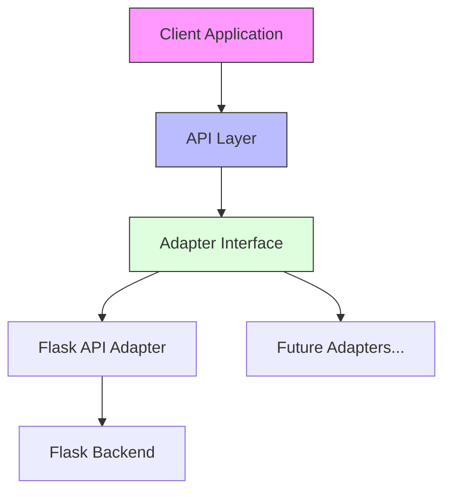

# Disease Prediction System Implementation Plan

## System Architecture



## Components

### 1. API Configuration
Location: `server/src/config/api.config.js`
```javascript
{
  baseUrl: 'http://localhost:5001',  // Flask ML service
  endpoints: {
    symptoms: '/api/symptoms',
    predict: '/api/predict'
  },
  timeouts: {
    default: 5000
  }
}
```

### 2. Adapter Interface (`ApiAdapter.js`)
- Base class for all API implementations
- Defines core methods:
  - `getSymptoms()`
  - `predictDisease(symptoms[])`
  - `handleError(error)`

### 3. Flask API Adapter (`FlaskApiAdapter.js`)
- Implements ApiAdapter interface
- Handles communication with Flask ML backend
- Standardizes error handling and responses

### 4. Response Types
- `ApiResponse`: Standard response wrapper
  ```javascript
  {
    success: boolean,
    data: object | null,
    error: string | null
  }
  ```
- `PredictionResult`: Disease prediction response
  ```javascript
  {
    disease: string,
    precautions: string[]
  }
  ```

## Integration Steps

1. **Setup Configuration**
   - Create api.config.js with Flask backend settings
   - Configure timeouts and endpoints

2. **Implement Base Adapter**
   - ApiAdapter class with interface methods
   - Standard response and error types
   - Error handling utilities

3. **Flask Integration**
   - Implement FlaskApiAdapter
   - Connect to Flask ML service
   - Handle API responses and errors

4. **Client Integration**
   - Create disease prediction service
   - Integrate with patient dashboard
   - Add error handling and loading states

## Error Handling

The system implements a robust error handling strategy:
- Network errors (connection timeouts, server unreachable)
- API errors (invalid responses, server errors)
- Client errors (invalid input, missing data)

## Future Extensions

1. **Additional Adapters**
   - Support for multiple ML backends
   - Easy integration of new prediction services
   - A/B testing between different models

2. **Caching Layer**
   - Cache symptom lists
   - Cache common predictions
   - Implement service worker for offline support

3. **Enhanced Features**
   - Confidence scores for predictions
   - Multiple disease suggestions
   - Treatment recommendations
   - Doctor referral integration

## Usage Example

```javascript
// Initialize adapter
const adapter = new FlaskApiAdapter();

// Get symptoms list
const symptoms = await adapter.getSymptoms();

// Predict disease
const prediction = await adapter.predictDisease(['fever', 'cough']);
```

## Testing Strategy

1. **Unit Tests**
   - Test adapter implementations
   - Validate response handling
   - Error handling scenarios

2. **Integration Tests**
   - End-to-end API flow
   - Error recovery
   - Response parsing

3. **Performance Tests**
   - Response times
   - Concurrent requests
   - Error rates

## Implementation Timeline

1. Week 1: Base Setup
   - Create configuration
   - Implement base adapter
   - Setup testing framework

2. Week 2: Flask Integration
   - Implement Flask adapter
   - Connect to ML service
   - Basic error handling

3. Week 3: Client Integration
   - UI implementation
   - Service integration
   - User testing

4. Week 4: Polish & Deploy
   - Performance optimization
   - Documentation
   - Deployment